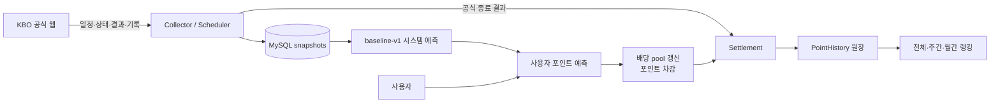
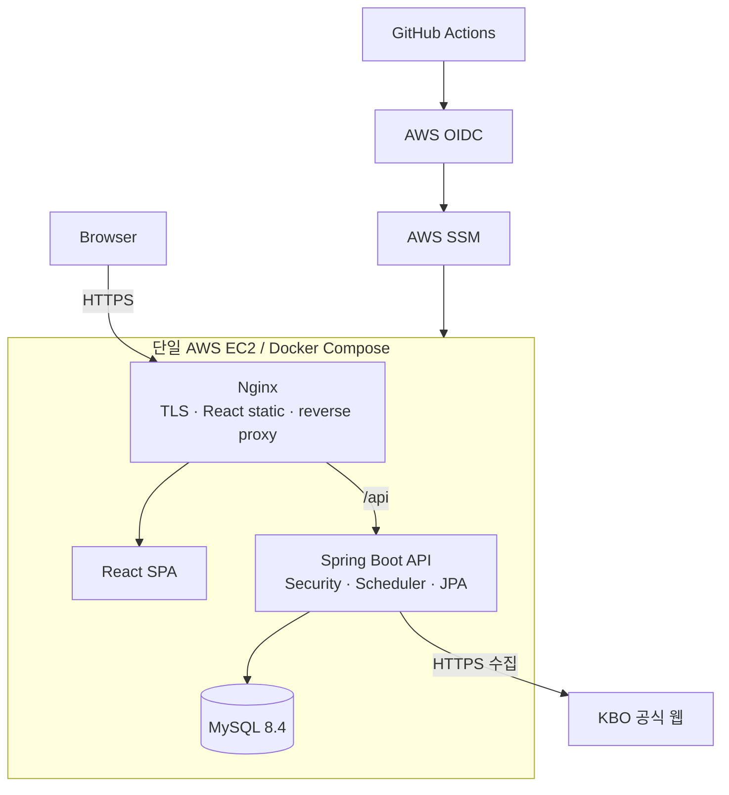
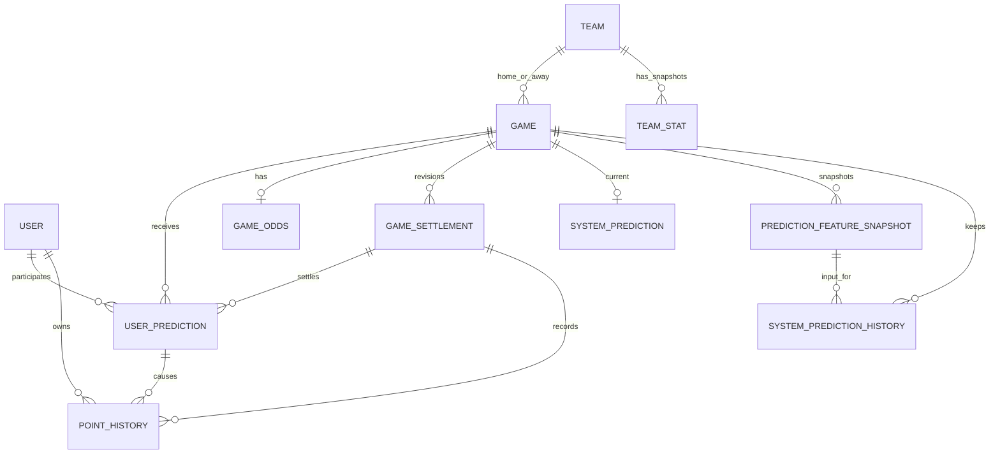

# PlayBall

공식 KBO 데이터를 수집해 경기 흐름을 예측하고, 사용자의 포인트 예측을 경기 결과에 따라 자동 정산하는 서비스입니다.

[운영 사이트](https://playball.ai.kr) · [코드 기반 프로젝트 분석](docs/PROJECT_ANALYSIS.md)

<!-- TODO: 메인 경기 목록 + 시스템 예측 + 사용자 예측 화면 스크린샷 -->

> 운영 예측은 머신러닝이 아니라 10개 통계 feature와 수동 weight를 사용하는 규칙/통계 기반 `baseline-v1`입니다.<br>
> scikit-learn으로 학습한 실제 ML 모델 `logistic-v1`은 동일한 데이터로 운영 모델과 비교하는 shadow 평가 단계입니다.

## 프로젝트 소개

KBO 일정, 경기 상태, 팀 기록과 선발투수 정보가 여러 공식 페이지에 나뉘어 있고, 단순 승리팀 투표만으로는 예측 과정과 결과를 지속적으로 관리하기 어렵다는 문제에서 시작했습니다.

PlayBall은 공식 데이터의 **수집 → 시점별 snapshot → 시스템 예측 → 사용자 포인트 참여 → 공식 결과 정산 → 랭킹**을 하나의 흐름으로 연결합니다. 특히 동시 포인트 변경, 결과 정정에 따른 재정산, 과거 경기 평가의 미래 데이터 누출 방지를 핵심 백엔드 문제로 다뤘습니다.

## 주요 기능

- **KBO 공식 데이터 수집** — 경기 일정·상태·결과, 팀 순위/성적, 팀 타율·ERA, 선발투수와 투수 기록을 scheduler와 관리자 요청으로 동기화합니다.
- **시스템 승부예측** — 팀·최근 경기·득실·타율·ERA·선발 지표를 사용하는 설명 가능한 `baseline-v1` 확률을 제공합니다.
- **사용자 포인트 예측과 배당** — 승·무·패에 포인트를 걸고 outcome별 누적 pool에 따라 변하는 pari-mutuel 배당을 제공합니다.
- **경기 종료 자동 정산** — 공식 종료·취소 결과를 확인한 뒤 배당 확정, 적중 지급 또는 환불, 포인트 원장 기록을 한 transaction으로 처리합니다.
- **랭킹** — 현재 포인트 랭킹과 주간·월간 정산 손익 랭킹을 현재 유효한 settlement revision 기준으로 계산합니다.
- **커뮤니티와 운영 도구** — 게시글·댓글·답글·반응·신고와 데이터 수집, 예측, 정산 복구를 위한 관리자 화면을 제공합니다.

## 서비스 흐름



## 기술 스택

| 영역 | 실제 사용 기술 |
|---|---|
| Frontend | React 19.2.7, TypeScript 5.9.3, Vite 7.3.6, React Router 7.8.2, Tailwind CSS 4.3.3 |
| Backend | Java 21, Spring Boot 4.1.0, Spring MVC, Spring Security 7.1.0, Spring Data JPA 4.1.0, Hibernate 7.4.1 |
| Database | MySQL 8.4, Flyway 12.4.0, HikariCP 7.0.2 |
| Prediction | Java `baseline-v1`, scikit-learn 1.7.2 `logistic-v1` artifact와 Java inference |
| Infrastructure | Docker, Docker Compose, Nginx 1.27, HTTPS/Certbot, AWS EC2·SSM, GitHub OIDC |
| Test | JUnit 5, MockMvc, Mockito, AssertJ, H2 MySQL mode, CI MySQL 8.4, Python unittest |

인증은 JWT가 아니라 **Spring Security server-side session** 방식입니다. BCrypt로 비밀번호를 저장하고, `PLAYBALL_SESSION` cookie와 CSRF cookie/header, credential CORS, `ROLE_ADMIN` 인가를 사용합니다.

## 시스템 아키텍처



## 핵심 설계

### 1. 동시 예측과 포인트 정합성

**문제**

같은 사용자가 여러 요청을 동시에 보내거나 여러 사용자가 같은 경기에 참여하면 잔액 lost update, 중복 예측, 배당 pool 누락이 발생할 수 있습니다.

**선택과 구현**

```text
Game PESSIMISTIC_WRITE
  → User PESSIMISTIC_WRITE
  → 사용자 예측 저장
  → outcome별 배당 pool 갱신
  → 사용자 포인트 차감
  → PointHistory 원장 기록
```

위 작업을 하나의 transaction으로 묶어 prediction, odds, balance, ledger 중 하나라도 실패하면 전부 rollback합니다.

- game → user 순서로 잠금을 고정해 예측·정산의 lock order를 맞췄습니다.
- application에서 경기 상태, 마감 시각, 포인트 단위·잔액, 기존 참여 여부를 검증합니다.
- `UNIQUE(user_id, game_id)`와 point `CHECK` constraint를 최종 방어선으로 사용합니다.
- 사전 조회를 동시에 통과한 요청은 insert 시점의 unique violation으로 다시 차단합니다.
- 동시 예측/정산/환불이 사용자 잔액에 모두 반영되는지 integration test로 검증합니다.

**한계**

같은 경기의 모든 참여가 game row 하나에서 직렬화되므로 인기 경기에서는 hot row와 lock wait가 발생할 수 있습니다. 현재 전략은 처리량보다 정합성을 우선한 설계이며, 규모가 커지면 critical section 축소와 atomic counter/update 구조를 검토해야 합니다.

### 2. 정산 rollback / correction / revision

**정상 정산**

```text
공식 경기 종료
  → 최종 배당 확정
  → 사용자 예측 WON / LOST / REFUNDED
  → 적중 포인트 지급 또는 취소 경기 환불
  → PointHistory 기록
  → Ranking 반영
```

한 경기의 전체 정산을 하나의 transaction으로 처리합니다. game row 잠금과 `(game_id, revision)`, `(prediction, type, settlement_revision)` unique constraint를 함께 사용해 중복 정산과 중복 지급을 막습니다.

**결과가 잘못된 경우**

```text
Settlement rollback
  → 기존 지급/환불 PointHistory reversal
  → 경기 결과 correction
  → 새 settlement revision 생성
  → 재정산
```

과거 결과와 지급 내역을 단순 `UPDATE`로 덮어쓰면 “어떤 결과로 얼마를 지급했고 왜 취소했는지”를 복구할 수 없습니다. 따라서 settlement를 revision으로 남기고, 원 지급 history를 가리키는 reversal history로 보상 작업을 기록합니다.

랭킹도 과거 rollback revision을 제외하고 **현재 active `SETTLED` revision**에 연결된 prediction과 reward만 집계합니다.

<!-- TODO: 관리자 정산 상태 + rollback/correction/revision 화면 스크린샷 -->

### 3. Point-in-time 예측 데이터와 ML shadow

**문제**

경기 종료 후 갱신된 기록을 과거 예측 입력에 사용하면 실제로는 알 수 없었던 미래 정보가 섞여 평가 결과가 부풀려집니다.

**선택과 구현**

- 운영 예측은 `collectedAt < gameStart`인 팀·선발투수 데이터만 사용합니다.
- 당시 입력은 `PredictionFeatureSnapshot`으로 저장합니다.
- 결과는 `SystemPredictionHistory`에 `PROVISIONAL / FINAL` stage로 구분해 남깁니다.
- `OPERATIONAL / BACKTEST / SHADOW` source를 분리해 화면용 운영 예측과 과거 평가, 실험 모델을 혼합하지 않습니다.
- historical feature builder는 대상 경기 이전의 종료 경기만 사용해 최근 성적을 다시 계산합니다.

**모델 구분**

```text
운영: baseline-v1
  10개 feature
  시즌/최근 승률 · 최근 득실 · 홈/원정 승률
  팀 타율 · 팀 ERA · 선발 ERA · 선발 WHIP
  → 사람이 지정한 weight와 scale
  → coverage 보정 + sigmoid 확률 변환

실험: logistic-v1
  scikit-learn multinomial logistic regression
  → JSON artifact
  → 시작 시 SHA-256 검증
  → Spring Boot에서 Java inference
  → 동일 FeatureSnapshot으로 shadow 비교
```

`logistic-v1`은 실제 ML 모델이지만 아직 운영 모델로 자동 승격되지 않습니다. 현재 코드에는 최소 sample·성능 기준에 따른 promotion gate가 없으며, draw class 부족과 live 평가가 남은 과제입니다.

<!-- TODO: 시스템 예측 근거 + baseline/logistic 비교 화면 스크린샷 -->

### 4. application 검증과 DB 무결성

Flyway V1~V27로 schema를 관리하고 Hibernate는 `ddl-auto=validate`만 수행합니다. 핵심 column의 `NOT NULL`, domain `FOREIGN KEY`, 중복 방지 `UNIQUE`, 점수·포인트·배당 `CHECK`를 migration으로 강화했습니다.

코드 검증은 사용자에게 빠르고 구체적인 오류를 제공하고, DB constraint는 race condition이나 잘못된 직접 쓰기에 대한 최종 방어선 역할을 합니다.

## 데이터베이스

전체 20개 entity/table 중 서비스 핵심 흐름만 나타낸 관계입니다.



- 현재 잔액은 `users.point`에서 빠르게 조회하고, 모든 변경 근거는 `point_histories`에 기록합니다.
- 랭킹 전용 table은 두지 않고 현재 사용자 잔액과 활성 settlement/ledger를 SQL CTE와 window function으로 집계합니다.
- 선발투수·투수 통계와 커뮤니티 domain은 가독성을 위해 위 ERD에서 생략했습니다.

## 주요 API

| Method | URL | 역할 | 권한 |
|---|---|---|---|
| POST | `/api/auth/signup` | 회원가입, 초기 포인트 지급, session 생성 | Public |
| POST | `/api/auth/login` | session 로그인, 일일 보너스 | Public |
| GET | `/api/games?date=` | 날짜별 경기, 시스템 예측·배당 조회 | Public |
| POST | `/api/user-predictions` | 사용자 포인트 예측 생성 | User |
| GET | `/api/points/me/history` | 내 포인트 원장 조회 | User |
| GET | `/api/rankings?type=` | 전체·주간·월간 랭킹 | Public |
| GET/POST | `/api/community/posts` | 게시글 조회·작성 | Public/User |
| POST | `/api/admin/data/games/sync` | KBO 경기 데이터 수동 동기화 | Admin |
| POST | `/api/admin/predictions/generate` | 날짜 또는 경기의 시스템 예측 생성 | Admin |
| POST | `/api/admin/games/{id}/settlement` | 수동 정산 또는 재정산 | Admin |
| POST | `/api/admin/games/{id}/settlement/rollback` | 최신 정산 revision 취소 | Admin |
| PUT | `/api/admin/games/{id}/result` | rollback 이후 경기 결과 정정 | Admin |

frontend 사용 여부를 포함한 전체 API는 [프로젝트 분석 문서](docs/PROJECT_ANALYSIS.md#6-주요-api와-frontend-사용-여부)에서 확인할 수 있습니다.

## 테스트

테스트는 기능 개수보다 데이터가 깨질 수 있는 경계를 중심으로 작성했습니다.

- 동시에 발생한 포인트 차감·정산 보상·취소 환불의 lost update 방지
- application 검증과 DB unique constraint를 통한 중복 예측 방지
- 반복·동시 정산과 rollback의 중복 지급/반전 방지
- 정산 중간 실패 시 이전 사용자 지급까지 rollback되는 atomicity
- 결과 correction 3개 revision과 현재 revision 기반 랭킹
- 경기 시작 이후 데이터가 과거 prediction feature에 섞이지 않는지 검증
- 10팀 통계가 불완전할 때 standings snapshot을 노출하지 않는지 검증
- KBO 응답 fixture parser와 선발투수 polling·변경 처리 검증

CI는 MySQL 8.4 service에서 backend 전체 test를 실행하고 frontend type check·production build와 Nginx/Docker 설정을 검증합니다. 일부 빠른 integration test는 H2 MySQL mode를 사용하며, 실제 MySQL concurrency test 확대는 향후 과제입니다.

## 배포

```text
main push
  ├─ Backend: Java 21 + MySQL 8.4 test
  └─ Frontend: Node 22 build + Docker/Nginx 검증
          ↓ 모두 성공
GitHub OIDC로 AWS IAM Role 획득
  → AWS SSM SendCommand
  → 단일 EC2에서 source 동기화와 Docker Compose build/up
  → Backend actuator health check
  → Frontend /healthz check
```

- Nginx가 React 정적 파일, `/api` reverse proxy, TLS termination을 담당합니다.
- Certbot timer와 deploy hook으로 인증서 갱신 후 Nginx를 reload합니다.
- backend는 host port를 직접 공개하지 않고 Compose network에서만 연결됩니다.
- 이전 image를 rollback tag로 보존하지만 실패 시 자동으로 복원하지는 않습니다.
- blue/green 또는 rolling replica가 없는 **단일 EC2 구조**이므로 무중단 배포나 고가용성 구성으로 표현하지 않습니다.
- MySQL도 EC2의 Compose container이며 RDS, ECS, Kubernetes는 사용하지 않습니다.

자세한 HTTPS 설정은 [HTTPS 배포 문서](docs/HTTPS_DEPLOYMENT.md)를 참고할 수 있습니다.

## 프로젝트 현황

**완료**

- session 인증, 포인트 원장, KBO 데이터 수집
- `baseline-v1` 운영 예측과 feature/history 관리
- 사용자 예측, 동적 배당, 종료·취소 경기 자동 정산
- settlement rollback/correction/resettlement
- 전체·주간·월간 랭킹, 커뮤니티, 주요 관리자 UI
- Flyway, Docker Compose, Nginx HTTPS, GitHub Actions·AWS SSM 배포

**부분 구현 또는 현재 범위 밖**

- `logistic-v1`은 학습·artifact·Java inference·shadow 평가까지 구현했지만 운영 모델은 아닙니다.
- 신고는 관리자 처리 상태를 기록하지만 게시물 삭제·사용자 제재 workflow와 자동 연결되지 않습니다.
- 관리자 API는 application log를 남기지만 actor와 변경 전후를 보존하는 DB audit trail은 없습니다.
- scheduler 중복 방지는 JVM 내부에 한정되며 distributed lock은 없습니다.
- 개별 타자/lineup 수집, WebSocket, 사용자·권한 관리, frontend 자동화 test는 구현되어 있지 않습니다.

**우선 개선 과제**

1. `users.point`와 `point_histories` 원장의 reconciliation·운영 alert
2. KBO HTML parser contract/freshness monitoring과 retry 정책
3. 실제 MySQL 기반 concurrency·lock timeout test 확대
4. Redis session과 DB 기반 distributed scheduler lock
5. ML shadow의 최소 sample·calibration·class별 지표 기반 promotion gate
6. CI에서 만든 immutable Docker image 배포와 실제 자동 rollback
7. 핵심 사용자 흐름의 frontend E2E test

## 로컬 실행

<details>
<summary>Java 21, Node.js 22, MySQL 8.4로 실행하기</summary>

Backend:

```powershell
$env:DB_URL='jdbc:mysql://localhost:3306/kbo_predictor?connectionTimeZone=Asia/Seoul&characterEncoding=UTF-8'
$env:DB_USERNAME='root'
$env:DB_PASSWORD='<local-password>'
$env:APP_FRONTEND_ORIGIN='http://localhost:5173'

cd backend
.\gradlew.bat bootRun
```

Frontend:

```powershell
cd frontend
npm ci
npm run dev
```

Docker Compose:

```powershell
Copy-Item .env.example .env
# .env의 비어 있는 값을 설정한 뒤
docker compose -f compose.yaml -f compose.local.yaml up --build
```

- Frontend: `http://localhost:3000`
- Backend: `http://localhost:8080`
- Health: `http://localhost:8080/actuator/health`

</details>

## 상세 문서

- [현재 코드 기준 전체 분석](docs/PROJECT_ANALYSIS.md)
- [프로젝트 면접 질문과 모범 답변](docs/INTERVIEW_GUIDE.md)
- [인증·인가와 웹 보안 구성](docs/SECURITY.md)
- [baseline-v1과 logistic-v1 비교](docs/MODEL_COMPARISON_BASELINE_V1_VS_LOGISTIC_V1_2026-08-14.md)
- [운영 shadow final 평가 기준](docs/OPERATIONAL_SHADOW_FINAL_EVALUATION.md)
- [HTTPS와 인증서 갱신](docs/HTTPS_DEPLOYMENT.md)
