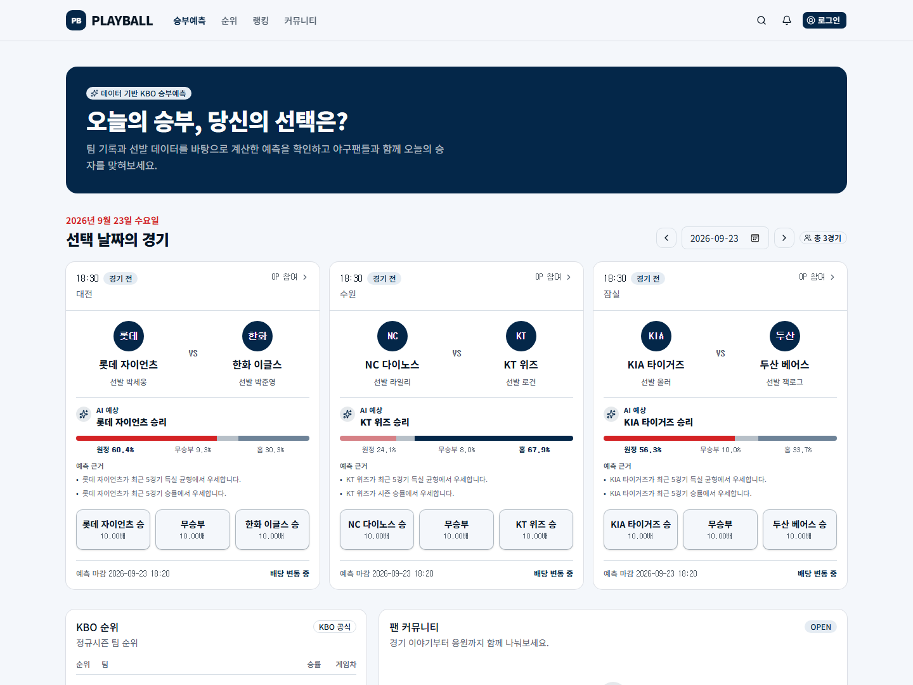
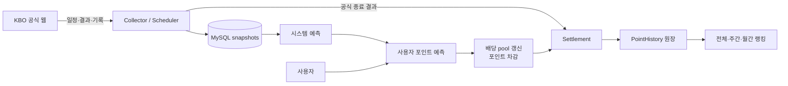
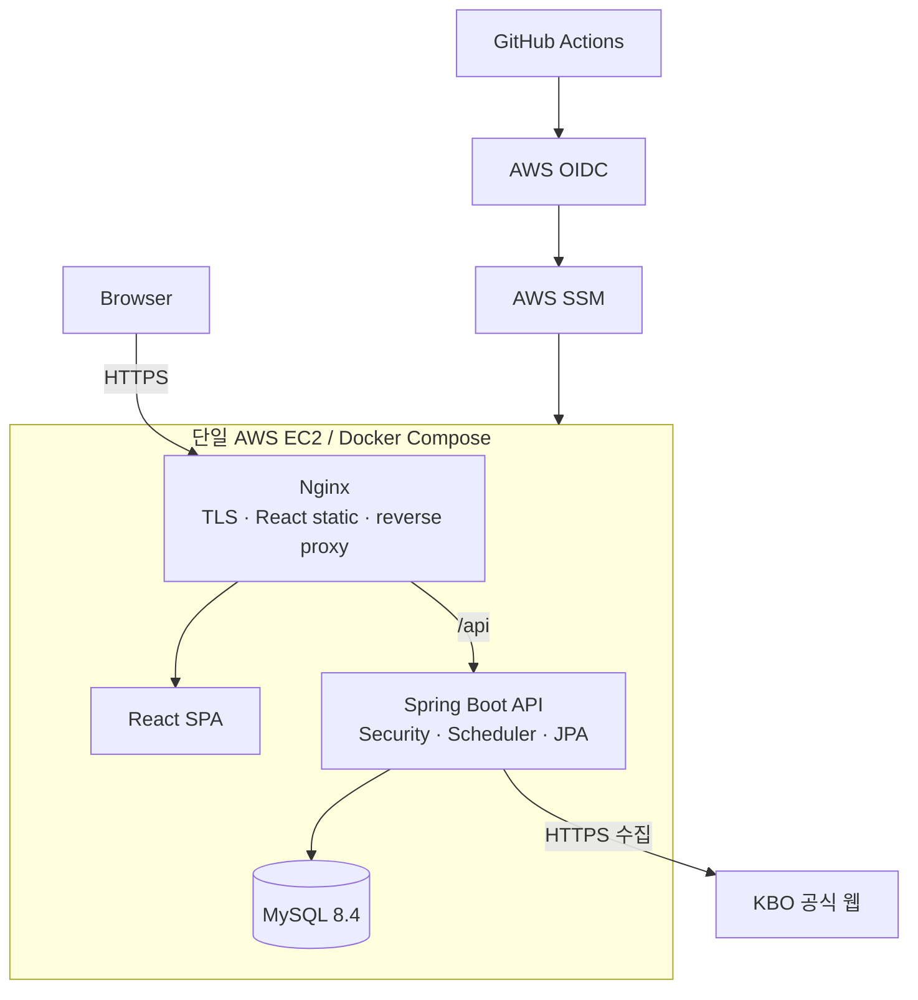
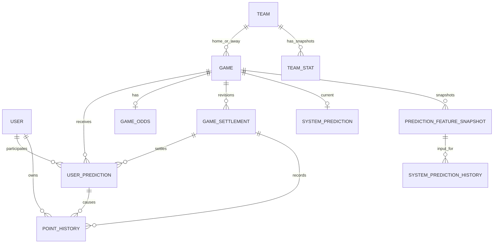

# PlayBall

KBO 공식 경기 데이터를 수집해 시스템 승부예측과 사용자 포인트 예측을 제공하고, 경기 종료 후 결과를 자동 정산하는 서비스입니다.

[운영 사이트](https://playball.ai.kr) · [상세 기술 문서](docs/PROJECT_ANALYSIS.md)

[](https://playball.ai.kr)

## 프로젝트 소개

KBO 경기 데이터를 직접 수집해 승부예측부터 사용자 참여와 결과 정산까지 하나의 서비스로 만들어보고 싶어 시작한 개인 프로젝트입니다.

PlayBall은 공식 데이터의 **수집 → 시점별 snapshot → 시스템 예측 → 사용자 포인트 참여 → 공식 결과 정산 → 랭킹**을 하나의 흐름으로 연결합니다. 동시 포인트 변경, 결과 정정에 따른 재정산, 과거 경기 평가의 미래 데이터 누출 방지를 핵심 백엔드 문제로 다뤘습니다.

## 주요 기능

- **KBO 공식 데이터 수집** — 경기 일정·상태·결과, 팀 성적, 선발투수와 투수 기록을 scheduler와 관리자 요청으로 동기화합니다.
- **시스템 승부예측** — 팀·최근 경기·득실·타율·ERA·선발 지표를 바탕으로 확률과 예측 근거를 제공합니다.
- **사용자 포인트 예측과 배당** — 승·무·패에 포인트를 걸고 outcome별 누적 pool에 따라 변하는 pari-mutuel 배당을 제공합니다.
- **경기 종료 자동 정산** — 공식 결과 확인 후 배당 확정, 적중 지급 또는 환불, 포인트 원장 기록을 한 transaction으로 처리합니다.
- **랭킹** — 현재 포인트와 주간·월간 정산 손익을 현재 유효한 settlement revision 기준으로 계산합니다.
- **커뮤니티와 운영 도구** — 게시글·댓글·반응·신고 기능과 데이터 수집, 예측, 정산 복구를 위한 관리자 화면을 제공합니다.

## 서비스 흐름



## 기술 스택

| 영역 | 기술 |
|---|---|
| Frontend | React 19, TypeScript, Vite, React Router, Tailwind CSS |
| Backend | Java 21, Spring Boot 4, Spring Security, Spring Data JPA |
| Database | MySQL 8.4, Flyway |
| Prediction | Java `baseline-v1`, scikit-learn `logistic-v1`, Java inference |
| Infrastructure | Docker, Nginx, AWS EC2·SSM, GitHub Actions |
| Test | JUnit 5, MockMvc, Mockito, AssertJ, H2, MySQL, Python unittest |

인증은 Spring Security의 **server-side session** 방식입니다. BCrypt 비밀번호 저장, session·CSRF cookie, credential CORS와 `ROLE_ADMIN` 인가를 적용했습니다.

## 시스템 아키텍처



## 핵심 설계

### 1. 동시 예측과 포인트 정합성

같은 사용자의 동시 요청이나 한 경기에 몰린 참여로 잔액 lost update, 중복 예측, 배당 pool 누락이 생길 수 있습니다.

`Game PESSIMISTIC_WRITE → User PESSIMISTIC_WRITE` 순서로 잠근 뒤 예측 저장, 배당 갱신, 포인트 차감, 원장 기록을 하나의 transaction에서 처리합니다. application 검증과 함께 `UNIQUE(user_id, game_id)`, point `CHECK` constraint를 최종 방어선으로 사용하고 동시성 integration test로 검증했습니다.

현재는 정합성을 처리량보다 우선해 같은 경기의 참여가 직렬화됩니다. 규모가 커지면 critical section 축소와 atomic update 구조가 필요합니다.

### 2. 정산 rollback / correction / revision

```text
공식 경기 종료 → 배당 확정 → 적중 지급 또는 환불 → PointHistory 기록

잘못된 결과 발견 → 기존 지급 reversal → 결과 correction → 새 revision 재정산
```

game row 잠금과 settlement revision별 unique constraint로 중복 정산·지급을 막습니다. 과거 지급을 덮어쓰지 않고 원 지급 history를 가리키는 reversal을 남기며, 랭킹은 현재 active `SETTLED` revision만 집계합니다.

### 3. Point-in-time 데이터와 ML shadow

경기 종료 후 갱신된 기록이 과거 예측에 섞이지 않도록 `collectedAt < gameStart` 데이터만 사용하고 당시 입력을 `PredictionFeatureSnapshot`으로 저장합니다. 운영·과거 평가·실험 결과는 `OPERATIONAL / BACKTEST / SHADOW` source로 분리했습니다.

- **운영 `baseline-v1`** — 10개 통계 feature에 사람이 지정한 weight와 scale을 적용하는 규칙/통계 기반 모델입니다.
- **실험 `logistic-v1`** — scikit-learn으로 학습한 multinomial logistic regression을 JSON artifact로 저장하고 Spring Boot에서 Java로 추론합니다.

`logistic-v1`은 동일 snapshot으로 운영 모델과 비교하는 shadow 평가 단계이며, 아직 자동 승격 기준과 draw class 검증이 남아 있어 운영 모델로 사용하지 않습니다.

### 4. application 검증과 DB 무결성

Flyway migration으로 `NOT NULL`, `FOREIGN KEY`, `UNIQUE`, 점수·포인트·배당 `CHECK`를 관리하고 Hibernate는 `ddl-auto=validate`만 수행합니다. application 검증은 구체적인 오류를 빠르게 제공하고, DB constraint는 race condition과 잘못된 직접 쓰기를 막는 최종 방어선 역할을 합니다.

구현 근거, trade-off와 테스트에 관한 자세한 내용은 [프로젝트 분석 문서](docs/PROJECT_ANALYSIS.md)에서 확인할 수 있습니다.

## 데이터베이스

전체 20개 entity/table 중 서비스 핵심 흐름만 나타낸 관계입니다.



현재 잔액은 `users.point`에서 빠르게 조회하고 모든 변경 근거는 `point_histories`에 기록합니다. 랭킹 전용 table 없이 현재 잔액과 활성 settlement/ledger를 SQL CTE와 window function으로 집계합니다.

## 주요 API

<details>
<summary>대표 API 보기</summary>

| Method | URL | 역할 | 권한 |
|---|---|---|---|
| POST | `/api/auth/login` | session 로그인, 일일 보너스 | Public |
| GET | `/api/games?date=` | 경기, 시스템 예측·배당 조회 | Public |
| POST | `/api/user-predictions` | 사용자 포인트 예측 생성 | User |
| GET | `/api/rankings?type=` | 전체·주간·월간 랭킹 | Public |
| POST | `/api/admin/data/games/sync` | KBO 경기 데이터 동기화 | Admin |
| POST | `/api/admin/games/{id}/settlement` | 수동 정산 또는 재정산 | Admin |
| POST | `/api/admin/games/{id}/settlement/rollback` | 최신 정산 revision 취소 | Admin |
| PUT | `/api/admin/games/{id}/result` | rollback 이후 경기 결과 정정 | Admin |

</details>

frontend 사용 여부를 포함한 전체 API는 [프로젝트 분석 문서](docs/PROJECT_ANALYSIS.md#6-주요-api와-frontend-사용-여부)에 정리했습니다.

## 테스트

테스트는 기능 개수보다 데이터가 깨질 수 있는 경계를 중심으로 작성했습니다.

- 동시 포인트 차감·정산·환불의 lost update와 중복 지급 방지
- 정산 중간 실패의 atomic rollback과 결과 correction revision 검증
- 경기 시작 이후 데이터가 과거 prediction feature에 섞이지 않는지 검증
- KBO fixture parser와 선발투수 polling·변경 처리 검증

CI는 MySQL 8.4에서 backend test를 실행하고 frontend type check·production build와 Nginx/Docker 설정을 검증합니다. H2 MySQL mode도 일부 빠른 integration test에 사용하며, 실제 MySQL concurrency test 확대는 향후 과제입니다.

## 배포

```text
main push
  → Backend test + Frontend build + Docker/Nginx 검증
  → GitHub OIDC로 AWS IAM Role 획득
  → AWS SSM으로 단일 EC2에 Docker Compose 배포
  → Backend actuator + Frontend /healthz 확인
```

Nginx가 React 정적 파일, `/api` reverse proxy와 TLS termination을 담당하며 backend port는 외부에 직접 공개하지 않습니다. 이전 image를 rollback tag로 보존하지만 자동 복원은 구현하지 않았습니다. 또한 단일 EC2와 container MySQL 구조이므로 무중단 배포나 고가용성 구성으로 표현하지 않습니다.

자세한 설정은 [HTTPS 배포 문서](docs/HTTPS_DEPLOYMENT.md)를 참고할 수 있습니다.

## 프로젝트 현황

**구현 완료**

- session 인증, 포인트 원장, KBO 데이터 수집
- 시스템·사용자 예측, 동적 배당, 종료·취소 경기 자동 정산
- settlement rollback/correction/resettlement와 revision 기반 랭킹
- 커뮤니티, 관리자 UI, Flyway, Docker/Nginx, GitHub Actions·AWS SSM 배포

**현재 한계와 개선 과제**

- `logistic-v1`은 shadow 평가 단계이며 운영 승격 기준과 live 평가가 필요합니다.
- scheduler 중복 방지는 JVM 내부에 한정되며 distributed lock은 없습니다.
- 관리자 작업의 DB audit trail과 핵심 사용자 흐름의 frontend E2E test가 필요합니다.
- 원장 reconciliation·alert, KBO parser monitoring, 실제 MySQL concurrency test를 강화할 예정입니다.

## 로컬 실행

<details>
<summary>Java 21, Node.js 22, MySQL 8.4로 실행하기</summary>

Backend:

```powershell
$env:DB_URL='jdbc:mysql://localhost:3306/kbo_predictor?connectionTimeZone=Asia/Seoul&characterEncoding=UTF-8'
$env:DB_USERNAME='root'
$env:DB_PASSWORD='<local-password>'
$env:APP_FRONTEND_ORIGIN='http://localhost:5173'

cd backend
.\gradlew.bat bootRun
```

Frontend:

```powershell
cd frontend
npm ci
npm run dev
```

Docker Compose:

```powershell
Copy-Item .env.example .env
# .env의 비어 있는 값을 설정한 뒤
docker compose -f compose.yaml -f compose.local.yaml up --build
```

- Frontend: `http://localhost:3000`
- Backend: `http://localhost:8080`
- Health: `http://localhost:8080/actuator/health`

</details>

## 상세 문서

- [현재 코드 기준 전체 분석](docs/PROJECT_ANALYSIS.md)
- [인증·인가와 웹 보안 구성](docs/SECURITY.md)
- [baseline-v1과 logistic-v1 비교](docs/MODEL_COMPARISON_BASELINE_V1_VS_LOGISTIC_V1_2026-08-14.md)
- [운영 shadow final 평가 기준](docs/OPERATIONAL_SHADOW_FINAL_EVALUATION.md)
- [HTTPS와 인증서 갱신](docs/HTTPS_DEPLOYMENT.md)
